_## 1. Java跨平台原理的解释


Java 的跨平台原理可以用一句最经典的话来概括：**“一次编写，到处运行” (Write Once, Run Anywhere)**。

要理解这个原理，我们需要搞清楚三个核心角色：**源代码 (.java)**、**字节码 (.class)** 和 **Java虚拟机 (JVM)**。

以下我用通俗易懂的方式为你解释：

### 核心概念：中间商 (JVM) 与 通用语言 (字节码)

传统的编程语言（如 C 或 C++）是直接将代码编译成特定操作系统（如 Windows 或 Linux）能听懂的**机器码**。

- **问题**：Windows 的“方言”和 Linux 的“方言”不一样。所以在 Windows 上编译的 .exe 程序，拿到 Linux 上是根本跑不起来的。

**Java 的做法不同，它引入了一个“中间商”——JVM。**

#### 第一步：编译成“字节码” (Bytecode)

当你写好 Java 代码（.java 文件）并进行编译时，编译器（javac）**不会**把它编译成电脑能直接运行的机器码，而是编译成一种特殊的中间格式，叫做**字节码（.class 文件）**。

- **特点**：这个字节码是**通用的**，它跟具体的操作系统（Windows/Mac/Linux）无关，只跟 Java 规范有关。


## 2. 成员变量与局部变量的区别？

由于变量声明的位置不同，可以将变量分为成员变量和局部变量。

**成员变量**位于类中、方法之外的变量，即属性。

**局部变量**位于类中、并处于方法中或代码块中的变量。

成员变量和局部变量有如下6个区别。

- 声明位置不同。

成员变量：类中、方法之外。

局部变量：类中、方法中/代码块中。

- 作用范围不同。

成员变量：整个类中。

局部变量：当前的方法/当前的代码块。

- 是否有默认值。

成员变量：如果属性没有赋值，有默认初始值。

局部变量：无默认值。

| 数组类型     | 默认初始值 |
| ------------ | ---------- |
| byte类型     | 0          |
| short类型    | 0          |
| int类型      | 0          |
| long类型     | 0          |
| float类型    | 0.0        |
| double类型   | 0.0        |
| char类型     | '\u0000'   |
| boolean类型  | false      |
| 引用数据类型 | null       |

- 是否需要初始化。

成员变量：不需要初始化，有默认初始值。

局部变量：必须进行初始化，否则报错。

- 在内存中的位置。

成员变量：在堆内存中。

局部变量：在栈内存中。

- 作用时间不同。

成员变量：从对象的创建阶段开始，到消亡之前结束。

局部变量：当前方法或代码块执行结束，局部变量就会消失。

## 3. 静态变量有什么作用？

在Java编程语言中，静态变量（也称为类变量）是定义在类内部、方法外部的变量，并使用`static`关键字进行修饰。静态变量与类的实例（对象）无关，而是属于类本身。这意味着，无论创建了多少个类的实例，静态变量在内存中只会有一个副本，并且由所有实例共享。

以下是Java中静态变量的主要作用：

1. 共享数据：

- - 静态变量允许类的所有实例共享同一个数据值。例如，你可以使用静态变量来跟踪类的实例数量，或者存储与类本身相关的配置信息。

1. 访问便利性：

- - 静态变量可以通过类名直接访问，而无需创建类的实例。这提供了在不需要对象上下文的情况下访问数据的便利性。

1. 实现常量：

- - 静态变量通常用于定义常量，即其值在程序执行期间不会改变的变量。这些常量通常使用大写字母和下划线命名（例如，`MAX_VALUE`），并通过`public static final`进行修饰，以表示它们是公开的、静态的且不可变的。

1. 节省内存：

- - 由于静态变量在内存中只有一个副本，并且被类的所有实例共享，因此它们可以节省内存空间。这对于需要大量实例且每个实例都需要访问相同数据的类来说尤其有用。

代码展示：

```java
public class Test {
    int id;
    static int sid;

    public static void main(String[] args) {
        Test t1 = new Test();
        t1.id = 10;
        t1.sid = 10;

        Test t2 = new Test();
        t2.id = 20;
        t2.sid = 20;

        Test t3 = new Test();
        t3.id = 30;
        t3.sid = 30;

    }
}
```

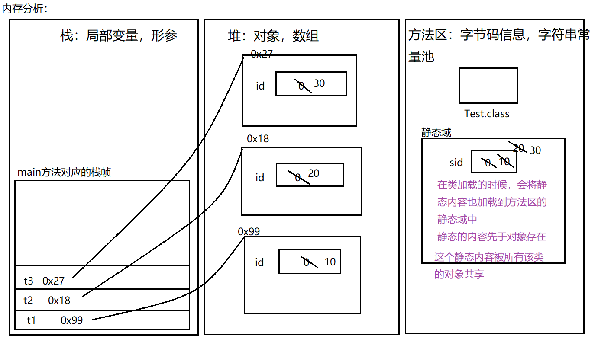

## 4. 自增自减运算符

自增运算符：

无论这个变量是否参与到运算中去，只要用++运算符，这个变量本身就加1操作

只是说如果变量参与到运算中去的话，对运算结果是产生影响：

看++在前还是在后，如果++在后：先运算，后加1；如果++在前，先加1，后运算

自减运算符：

无论这个变量是否参与到运算中去，只要用--运算符，这个变量本身就减1操作

只是说如果变量参与到运算中去的话，对运算结果是产生影响：

看--在前还是在后，如果--在后：先运算，后减1； 如果--在前，先减1，后运算

代码展示：

```java
public class TestOpe04{
    public static void main(String[] args){
        int a = 5;
        a++;//理解为：相当于  a=a+1 操作  
        System.out.println(a);//6
        
        a = 5;
        ++a;//理解为：相当于  a=a+1 操作  
        System.out.println(a); //6
        
        //总结：++单独使用的时候，无论放在前还是后，都是加1操作
        
        //将++参与到运算中：
        //规则：看++在前还是在后，如果++在后：先运算，后加1   如果++在前，先加1，后运算
        a = 5;
        int m = a++ + 7;//先运算  m=a+7  再加1：  a = a+1 
        System.out.println(m);//12
        System.out.println(a);//6
        
        a = 5;
        int n = ++a + 7;//先加1  a=a+1  再运算：  n = a+7 
        System.out.println(n);//13
        System.out.println(a);//6
    }
}
```


## 5. String相关内存

- String s = new String("xyz");创建了几个String Object? 

**情况1：第一次执行这行代码（"xyz"不在常量池中）**

String s = new String("xyz");

会创建 2个 String对象：

1. 1. "xyz" - 字符串常量，存入字符串常量池
   2. new String("xyz") - 在堆中新建的String对象

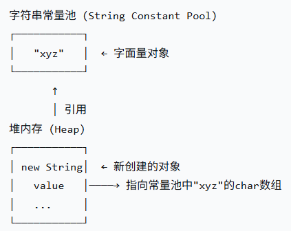

**情况2："xyz"已经在常量池中存在时**

```
// 之前已经有代码使用了"xyz" String temp = "xyz";      // 第一次，创建常量池中的"xyz" // ... 其他代码 ... String s = new String("xyz");  // 只创建1个新对象
```

只创建 1个 String对象：

- - 堆中的新String对象（引用常量池中已存在的"xyz"）

- 下面这条语句一共创建了多少个对象：String s="a"+"b"+"c"+"d";

javac编译可以对字符串常量直接相加的表达式进行优化（编译期优化），不必要等到运行期去进行加法运算处理，而是在编译时去掉其中的加号，直接将其编译成一个这些常量相连的结果。上述代码被编译器在编译时优化后，相当于直接定义了一个 "abcd" 的字符串，所以只创建了一个String对象。

- 下面代码底层是如何实现的？

```java
String s1 = "a";
String s2 = s1 + "b";// 运行时字符串拼接
String s3 = "a" + "b";
System.out.println(s2 == "ab");//false
System.out.println(s3 == "ab");//true 
```

编译后字节码分析：

```java
String s1 = "a";
String s2 = new StringBuilder().append(s1).append("b").toString();
```

步骤解析：

```java
// 步骤分解：
StringBuilder sb = new StringBuilder();  // 1. 创建StringBuilder对象
sb.append(s1);                           // 2. StringBuilder内部操作
sb.append("b");                          // 3. StringBuilder内部操作  
String s2 = sb.toString();               // 4. 创建新的String对象
```

内存：

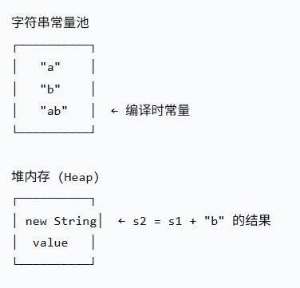


## 6. 说明String 、StringBuilder及StringBuffer的区别。

| String                         | StringBuilder                    | StringBuffer                         |
| ------------------------------ | -------------------------------- | ------------------------------------ |
| 不可变的常量，线程安全但性能低 | 可变的字符串，**单线程性能之王** | 可变的字符串，**多线程下的安全选择** |
| **不可变**                     | **可变 + 非线程安全**            | **可变 + 线程安全**                  |

- 一、String的内存机制（不可变性）

String的核心特点是**不可变性**。任何修改操作都会创建新对象。

```java
String str = "Hello";
str = str + " World";
```

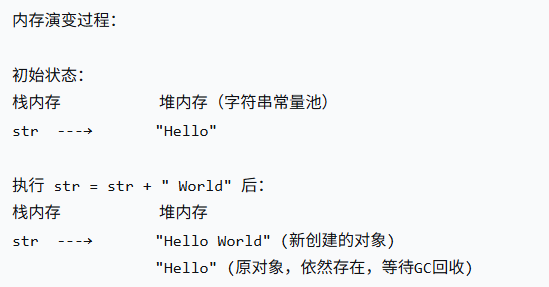

关键点：

- - **原有对象"Hello"不会被修改**，而是被丢弃
  - **新对象"Hello World"被创建**，str引用指向新对象
  - 如果频繁修改，会产生大量垃圾对象，影响性能

- 二、StringBuilder的内存机制（可变性）

StringBuilder在**原有对象**的基础上进行修改，不创建新对象。

```java
StringBuilder sb = new StringBuilder("Hello");
sb.append(" World");
```

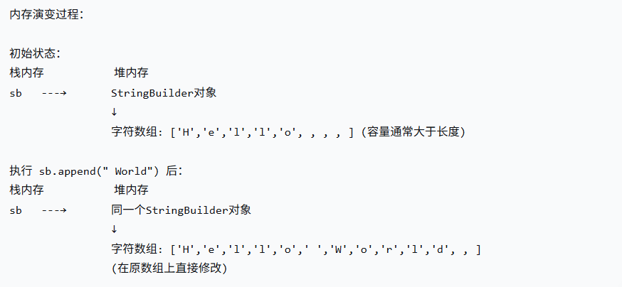

关键点：

- - **始终是同一个StringBuilder对象**
  - 内部维护一个**可扩展的字符数组**
  - 当容量不足时，会**自动扩容**（创建新数组，复制数据），但对象引用不变

- 三、StringBuffer的内存机制（可变性 + 线程安全）

StringBuffer的内存机制与StringBuilder基本相同，区别在于**同步锁**。

```java
StringBuffer sbf = new StringBuffer("Hello");
sbf.append(" World");
```

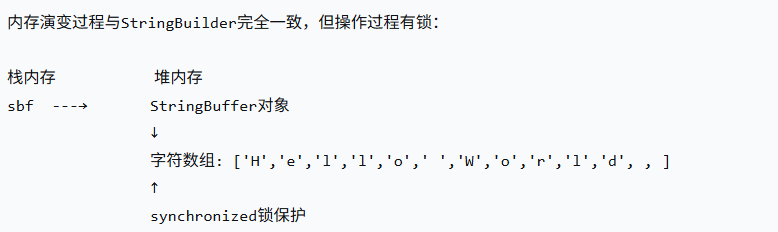

关键点：

- - 内存变化与StringBuilder相同
  - 但每个方法都有**synchronized同步锁**，保证多线程安全
  - 锁机制带来性能开销

## 7. final关键字的作用

- final修饰变量

使用final关键字修饰一个基本数据类型的变量时，其值不可以变；修饰引用数据类型变量时，是指地址不能变，地址所指向的对象中的内容还是可以改变的。

```java
public class Student {
    int id;
    String name;

    public Student(int id, String name) {
        this.id = id;
        this.name = name;
    }
}
public class Demo {
    public static void main(String[] args) {
        final int NUM = 10;
        // NUM = 20;报错
        final Student s = new Student(1001,"feifei");
        // s = new Student(2002,"lulu");报错
        s.id = 9008;
        System.out.println(s.id);
    }
}
```

- final修饰方法

- - **作用**：防止子类重写（override）该方法。
  - **使用场景**：认为该方法实现已经完美，不希望被子类修改。

```java
class Parent {
    // final方法，不能被子类重写
    public final void show() {
        System.out.println("这是父类的最终实现");
    }
    
    public void normalMethod() {
        System.out.println("普通方法可以重写");
    }
}

class Child extends Parent {
    // ❌ 编译错误：不能重写final方法
    // @Override
    // public void show() { }
    
    // ✅ 允许：重写普通方法
    @Override
    public void normalMethod() {
        System.out.println("子类重写了普通方法");
    }
}
```

- final修饰类、

- - **作用**：阻止类被继承。
  - **使用场景**：认为该类功能已经完整，不需要扩展，或者出于安全考虑不希望被继承。

```java
// final类，不能被继承
final class StringUtils {
    public static boolean isEmpty(String str) {
        return str == null || str.length() == 0;
    }
}

// ❌ 编译错误：不能继承final类
// class MyStringUtils extends StringUtils { }
```

## 8. "=="和equals方法究竟有什么区别？

- **1. 用于基本数据类型（如 int, char, double 等）**

- - `**==**`：比较的是**值本身**是否相等。

```java
int a = 10;
int b = 10;
int c = 20;

System.out.println(a == b); // true，值相等
System.out.println(a == c); // false，值不相等
```

- - `**equals()**`：**基本数据类型不能调用方法**，所以无法使用。

```java
// a.equals(b); // 编译错误！基本数据类型不是对象，没有方法
```

- **2. 用于引用数据类型（如 String, 自定义对象等）**

- - 情况一：`==` 的行为

`**==**` **永远比较的是两个引用变量指向的"内存地址"是否相同**，即是否指向**堆内存中的同一个对象**。

```java
// 示例1：new关键字会在堆中创建新对象
String str1 = new String("Hello");
String str2 = new String("Hello");

System.out.println(str1 == str2); // false
// 原因：str1和str2指向两个不同的对象（内存地址不同）
// 示例2：字符串常量池的优化
String s1 = "Hello"; // 在字符串常量池中创建
String s2 = "Hello"; // 指向常量池中已存在的同一个"Hello"
String s3 = new String("Hello"); // 在堆中创建新对象

System.out.println(s1 == s2); // true (都指向常量池的同一地址)
System.out.println(s1 == s3); // false (s1在常量池，s3在堆，地址不同)
```

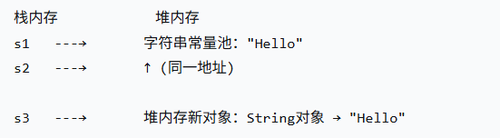

- - 情况二：`equals()` 的行为

`equals()` 方法定义在 `Object` 类中，其**默认实现**就是比较内存地址（和 `==` 一样）：

```java
// Object类中的equals方法默认实现
public boolean equals(Object obj) {
    return (this == obj); // 直接使用==比较地址
}
```

但是，许多重要的类（如 `String`、`Integer`、`Date` 等）**重写**了 `equals()` 方法，使其比较对象的"内容"是否相等。

```java
String str1 = new String("Hello");
String str2 = new String("Hello");

System.out.println(str1 == str2);      // false (比较地址)
System.out.println(str1.equals(str2)); // true  (比较字符串内容)
```

- **3. 自定义类如何正确使用** `**equals()**`

对于我们自己定义的类，如果需要"逻辑相等"的概念，就必须重写 `equals()` 方法。

示例：Person 类

```java
class Person {
    private String name;
    private int age;
    
    // 构造方法、getter/setter省略...
    
    // 重写equals方法，规定：姓名和年龄都相同，即为同一个人
    @Override
    public boolean equals(Object obj) {
        // 1. 检查是否自比较
        if (this == obj) return true;
        // 2. 检查是否为null或类型不同
        if (obj == null || this.getClass() != obj.getClass()) return false;
        
        // 3. 类型转换
        Person person = (Person) obj;
        
        // 4. 比较关键字段内容
        return age == person.age && 
               Objects.equals(name, person.name); // 使用Objects.equals避免空指针
    }

}

// 测试
Person p1 = new Person("Alice", 25);
Person p2 = new Person("Alice", 25);
Person p3 = new Person("Bob", 25);

System.out.println(p1 == p2);      // false (不同对象，地址不同)
System.out.println(p1.equals(p2)); // true  (内容逻辑相等)
System.out.println(p1.equals(p3)); // false (内容不同)
```

- **总结：**

"`==`和`equals()`的主要区别体现在两个方面：

第一，在**比较基本数据类型**时，`==`比较的是值是否相等，而基本类型不能使用`equals()`方法。

第二，在**比较引用数据类型**时，`==`比较的是两个引用是否指向内存中的同一个对象（地址比较）。而`equals()`是Object类的方法，默认行为与`==`相同，但很多类（如String）重写了该方法，用于比较对象的内容是否逻辑相等。

简单总结就是：`**==**`**是判断是否同一个对象，**`**equals()**`**是判断是否逻辑相等。**"

## 9. 基本类型和包装类型的区别？

Java中的基本类型（Primitive Types）和包装类型（Wrapper Classes）之间存在多个关键区别，这些区别主要体现在以下方面：

一、包含内容与性质

- 基本类型：只包含数据本身，不包含任何方法或操作。它们不是对象，因此没有对象的特性，如继承和多态。
- 包装类型：不仅包含数据，还包含了一系列的方法（如类型转换、比较等）和属性，是对基本类型数据的封装。包装类型是对象，具有对象的所有特性，如继承自Object类的功能（如toString()、equals()等）。

二、声明方式与存储位置

- 基本类型：直接声明变量并赋值，不需要使用new关键字。它们直接将值保存在栈内存中，访问速度较快。
- 包装类型：需要使用new关键字在堆内存中分配内存空间，或者使用自动装箱（JDK 5及以上版本支持）来创建对象。包装类型将对象放在堆内存中，通过栈中的引用来调用它们，访问速度相对较慢，并且需要考虑垃圾回收等额外开销。

三、初始值

- 基本类型：在声明时如果没有显式赋值，则会被赋予一个默认值。例如，int的默认值为0，boolean的默认值为false。
- 包装类型：在声明时如果没有显式赋值，则默认值为null，因为它们是引用类型。

四、使用方式

- 基本类型：直接用于数值计算、位运算等场景，效率较高。但由于它们不是对象，因此不能在需要对象的场合（如集合中）直接使用。
- 包装类型：主要用于需要对象的地方，如集合（List、Map等）中只能存储对象，因此基本类型需要通过包装类来转换为对象才能存储在集合中。此外，包装类型还提供了丰富的操作方法和常量。

五、泛型适用性

- 基本类型：不能直接用于泛型，因为泛型在编译时会进行类型擦除，而基本类型没有对应的类型信息可以擦除。
- 包装类型：可以用作泛型的类型参数，因为它们是对象类型，具有类型信息。例如，可以使用List<Integer>来存储整数对象。

六、内存占用与性能

- 基本类型：通常占用较少的内存空间，因为它们只存储数据本身。
- 包装类型：由于它们是对象，因此需要额外的内存来存储对象头和引用等信息。这可能导致在大量使用包装类型时增加内存开销。此外，自动装箱和拆箱操作也会消耗一定的性能。

综上所述，Java中的基本类型和包装类型在包含内容、性质、声明方式、存储位置、初始值、使用方式、泛型适用性、内存占用与性能等方面都存在明显的区别。在开发中，应根据具体需求选择合适的类型以提高代码的可读性、可维护性和性能。

---
- AI解答:
# 📦 Java 数据类型大比拼：基本类型 vs 包装类型 (Primitive vs Wrapper)

> **创建时间**：2026-03-10
> **标签**：#Java基础 #数据类型 #面试常问 #性能优化

面对 `int` 和 `Integer`、`double` 和 `Double`，初学者经常会懵圈：它们到底有什么区别？我该用哪一个？

抛开枯燥的学术名词，我们用**“散装零件”与“精装礼盒”**的类比，瞬间看透它们的本质区别。

---

## 一、 核心比喻

- ⚙️ **基本类型 (Primitive Types)** = **散装的螺丝钉**。
  - 例如：`int`, `double`, `boolean`。
  - 它只有数字本身，简单、纯粹、轻量级。
- 🎁 **包装类型 (Wrapper Classes)** = **精装的螺丝钉礼盒**。
  - 例如：`Integer`, `Double`, `Boolean` *(首字母大写！)*。
  - 这个礼盒里不仅装着数字，盒子外面还印着说明书，盒子里还附带了改锥（各种强大的自带方法）。

---

## 二、 6 大核心区别通俗解析

### 1. 包含内容与性质（能不能“干活”）
- **散装 `int`**：就是个单纯的数字。你不能对数字 `5` 下达指令，它只能被拿来做简单的数学运算（`+ - * /`）。
- **礼盒 `Integer`**：它是一个**高级对象**。除了装载数字，它还自带了许多功能按钮。比如，你可以直接调用 `Integer.parseInt("123")` 把字符串转成数字，这就是礼盒提供的额外服务。

### 2. 存储位置与速度（放哪了？）
- **散装 `int`**：存在**栈内存（工作台）**上。体积小，随手就能拿到，**访问速度极快**。
- **礼盒 `Integer`**：因为是对象，体积大，必须堆放在**堆内存（大仓库）**里。你在工作台（栈）上只留了一把仓库钥匙（内存地址/引用）。每次要用，得先拿钥匙去仓库找，所以**速度相对较慢**。

### 3. 初始默认值（没赋值时是什么？）
- **散装 `int`**：如果声明了但没赋值，Java 会强行塞给你一个默认的 **`0`**。
- **礼盒 `Integer`**：如果声明了没赋值，代表“这个礼盒根本不存在”，它的值是 **`null`（空）**。
> 🚨 **实战警告**：在电商系统里，如果商品价格用 `int` 且忘了赋值，就会变成 0 元包邮！如果用 `Integer`，则是 `null`，程序就能判断出“商家还未定价”。

### 4. 使用场合与泛型（能不能装进高级袋子里？）
这是包装类存在的最核心原因！
在 Java 中，高级集合（如 `ArrayList`, `HashMap`）就像是“只收精装礼盒的 VIP 购物袋”。**它们绝对不收散装零件！**
- ❌ `ArrayList<int>`：直接报错！
- ✅ `ArrayList<Integer>`：完全合法。

> 💡 **补充概念：自动装箱/拆箱 (Auto-boxing/unboxing)**
> 从 JDK 1.5 开始，当你写 `list.add(5);` 时，Java 底层会自动把散装数字 `5` 塞进 `Integer` 礼盒里再扔进袋子，这就叫自动装箱，反之叫拆箱。

### 5. 内存占用与性能（贵不贵？）
- **散装 `int`**：极其省地方，只消耗最基础的内存（4个字节）。
- **礼盒 `Integer`**：除了装数字，还要消耗内存去存储“礼盒的包装纸和防伪码”（也就是 JVM 层的**对象头**等信息）。如果有一千万个数字，用 `Integer` 会导致内存暴增，还会让垃圾回收器 (GC) 疯狂加班。

---

## 三、 💡 终极开发建议 (到底该用谁？)

在实际写代码时，请死记以下三条铁律：

1. 🔄 **做循环、数学计算、局部变量时：**
   👉 **必须用基本类型（`int`, `double`）**。因为它最快、最省内存！
   *(例：`for (int i = 0; i < 100; i++)` 绝对不要写成 `Integer i`)*

2. 🗄️ **在实体类（Entity/POJO）与数据库映射时：**
   👉 **强烈建议用包装类型（`Integer`, `Double`）**。因为数据库字段允许为 `NULL`。如果你用 `int` 去接数据库的 `NULL`，系统会直接抛出异常崩溃。

3. 🛍️ **在使用集合（List, Map, Set）时：**
   👉 **没得选，只能用包装类型。**


## 10. 包装类型的缓存机制了解么？

Java包装类型的缓存机制是Java中一个重要的性能优化手段。以下是对Java包装类型缓存机制的详细解释：

一、缓存机制概述

Java中的包装类（Wrapper Class）是为了将基本数据类型转换为对象而存在的。包装类都位于java.lang包中，使用时无需显式导入。包装类型缓存机制指的是，在某些情况下，Java会对一定范围内的包装类对象进行缓存，以减少对象的创建和销毁，从而提高性能和节省内存空间。

二、缓存机制的实现

包装类型的缓存机制是通过静态成员变量来实现的。在Integer、Long、Short、Byte、Character这五个包装类中，定义了一个静态数组cache[]，用于缓存常用的数值对象。当使用valueOf()方法创建包装类对象时，会先检查该值是否在缓存范围内。如果是，则直接返回缓存中的对象；否则，创建一个新的对象并可能放入缓存中（注意，对于超出缓存范围的新对象，有的包装类并不会将其放入缓存，这取决于具体的实现）。

三、各包装类的缓存范围

1. Integer：默认缓存了-128到127之间的整数。这个范围是根据实际应用中整型数据的常用范围来设定的，能够覆盖大多数常用情况。
2. Long：默认缓存了-128到127之间的长整数。
3. Short：默认缓存了-128到127之间的短整数。
4. Byte：默认缓存了-128到127之间的字节。由于byte的值范围本身就是-128到127，所以所有的Byte对象都使用缓存。
5. Character：默认缓存了0到127之间的字符。这是因为ASCII字符集只定义了128个字符，而Unicode字符集的前128个字符与ASCII字符集完全相同。
6. Boolean：只缓存了true和false两个对象。

需要注意的是，浮点数类型的包装类（Float和Double）并没有实现缓存机制，主要是因为浮点数的表示范围非常大，且使用场景多样，缓存效果并不明显。

以Integer为案例，在创建Integer对象的时候，底层会调用valueOf方法：

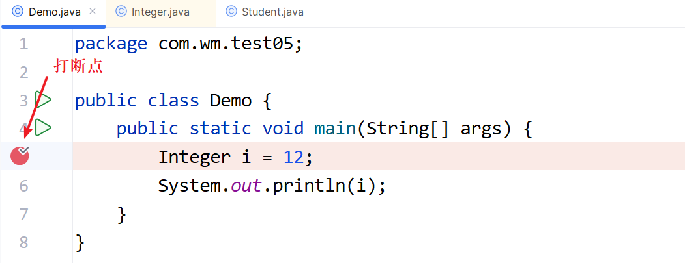

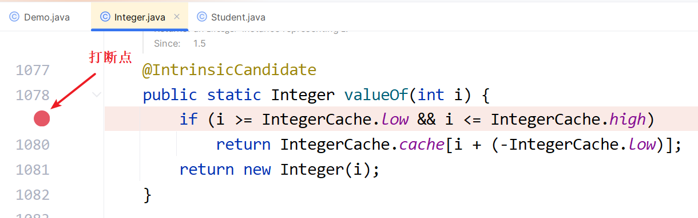

查看源码：

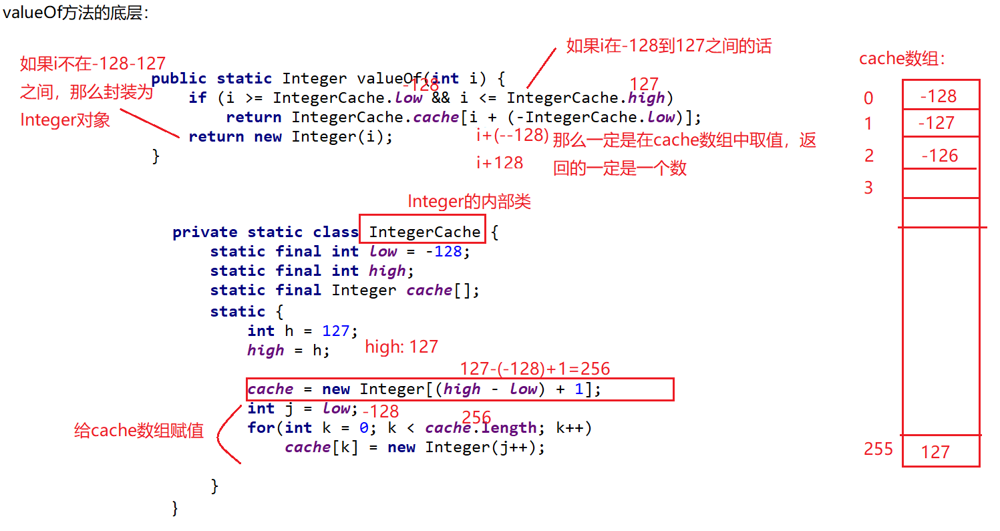

延伸面试题：

```java
public class Demo {
    public static void main(String[] args) {
        Integer i1 = 12;
        Integer i2 = 12;
        System.out.println(i1 == i2);// 结果是什么

        Integer i3 = 1200;
        Integer i4 = 1200;
        System.out.println(i3 == i4);// 结果是什么
    }
}
```


---

AI解答:
# 📦 Java 包装类的缓存机制 (以 Integer 为例)

> **创建时间**：2026-03-10
> **标签**：#Java底层 #包装类 #面试高频 #内存优化

在 Java 中，为了提高性能、减少内存开销，Java 设计者为部分包装类提供了一个**“缓存池”**机制。

这就像是 Java 底层提前去超市批发了一堆最常用的商品放在仓库里，你需要的时候直接拿现成的，不用每次都去工厂（`new`）现造。

---

## 一、 核心概念：什么是缓存机制？

当我们触发**自动装箱**（例如 `Integer i = 12;`），底层其实调用了 `Integer.valueOf(12)` 方法。

`valueOf()` 方法并不是傻乎乎地每次都去 `new` 一个新对象。它会先判断这个数字是否在**缓存范围内**：
- 如果**在**范围内：直接从底层的 `cache` 数组中返回已经创建好的对象。
- 如果**不在**范围内：老老实实去堆内存里 `new Integer(i)` 创建一个新对象。

---

## 二、 各个包装类的缓存范围 (速记)

并不是所有包装类都有缓存，而且范围也不同：

| 包装类 | 缓存范围 | 备注 |
| :--- | :--- | :--- |
| **`Byte`** | `-128` 到 `127` | 全部缓存（因为 byte 的极限就是这么多） |
| **`Short`** | `-128` 到 `127` | |
| **`Integer`** | **`-128` 到 `127`** | **最常考！** |
| **`Long`** | `-128` 到 `127` | |
| **`Character`**| `0` 到 `127` | 对应 ASCII 码表范围 |
| **`Boolean`** | `true` 和 `false` | 只有这俩，全部缓存 |
| **`Float`** | ❌ 无缓存 | 浮点数不可穷举，缓存无意义 |
| **`Double`** | ❌ 无缓存 | 同上 |

---

## 三、 源码剖析：IntegerCache 是怎么工作的？

查看 `Integer.valueOf(int i)` 的源码：


    public static Integer valueOf(int i) {
      // 默认判断：如果 i 在 -128 到 127 之间
      if (i >= IntegerCache.low && i <= IntegerCache.high)
        // 直接从缓存数组中取！不 new 新对象！
        return IntegerCache.cache[i + (-IntegerCache.low)];
    
      // 超出范围，只能造个新的
      return new Integer(i);
    }

## 🤯 四、 终极面试题解析
- 回到你在图片最后给出的那道延伸面试题：

    public class Demo {
       public static void main(String[] args) {
          Integer i1 = 12;
          Integer i2 = 12;
          System.out.println(i1 == i2); // 结果是什么？
        
          Integer i3 = 1200;
          Integer i4 = 1200;
          System.out.println(i3 == i4); // 结果是什么？
        }
    }
- 【解答与分析】
- ⚠️ 注意前提：对于对象引用来说，== 比较的是内存地址（是否是同一个对象）。
- System.out.println(i1 == i2); 结果是：true
- 原因：12 在 -128 ~ 127 的缓存范围内。
- i1 拿的是缓存池里那个唯一的、数字为 12 的对象地址。
- i2 拿的也是缓存池里同一个对象的地址。
- 门牌号一模一样，所以是 true。
- System.out.println(i3 == i4); 结果是：false
- 原因：1200 已经超出了 127 的缓存上限。
- 当执行 Integer i3 = 1200; 时，底层走的是 return new Integer(1200);，在堆内存里开辟了一块新空间。
- 当执行 Integer i4 = 1200; 时，底层又走了一遍 return new Integer(1200);，在堆内存里又开辟了一块全新的空间。
- 两个不同的对象，门牌号自然不同，所以 == 比较结果为 false。


## 11. 什么是可变参数？

在Java中，可变参数（Varargs）是一种语法特性，它允许一个方法接受不定数量的参数。这种特性极大地提升了方法的灵活性和可扩展性。

可变参数通过在参数类型后面添加省略号（...）来实现。这意味着在调用方法时，可以传入不同数量的参数，而不需要为每种情况分别定义方法。可变参数在方法内部实际上是被当作数组来处理的。

代码展示：

```java
public class TestArray12{
        /*
        1.可变参数：作用提供了一个方法，参数的个数是可变的 ,解决了部分方法的重载问题
        int...num
        double...num
        boolean...num
        
        
        2.可变参数在JDK1.5之后加入的新特性
        3.方法的内部对可变参数的处理跟数组是一样
        4.可变参数和其他数据一起作为形参的时候，可变参数一定要放在最后
        5.我们自己在写代码的时候，建议不要使用可变参数。
        */
    public static void main(String[] args){
                //method01(10);
                //method01();
                //method01(20,30,40);
                method01(30,40,50,60,70);
                //method01(new int[]{11,22,33,44});
        }
        public static void method01(int num2,int...num){
                System.out.println("-----1");
                for(int i:num){
                        System.out.print(i+"\t");
                }
                System.out.println();
                
                System.out.println(num2);
        }
}
```

---
AI解析:
# ♾️ Java 可变参数 (Varargs) 详解

> **创建时间**：2026-03-10
> **标签**：#Java基础 #方法参数 #语法特性

在 Java 中，当你不确定调用一个方法时到底需要传入多少个参数时，就可以使用**可变参数（Varargs）**。这是 JDK 1.5 引入的语法糖，极大地减少了方法重载的编写工作量。

---

## 一、 什么是可变参数？

**定义**：允许一个方法接受**不定数量**（0个、1个或多个）的同类型参数。
**语法**：在参数类型后面加上三个点 `...`。例如：`int... nums`。

> 💡 **本质揭秘**：
> 可变参数在底层其实就是一个**数组**。Java 编译器在背后帮你把传入的多个离散的参数，自动打包成了一个数组。所以在方法内部，你完全可以把它当成普通数组来遍历和操作。

---

## 二、 代码实战演示

    ```java
    public class VarargsDemo {
    
      public static void main(String[] args) {
        // 调用方式非常灵活：
        method01(10);                  // 传 0 个可变参数 (10 是给 num2 的)
        method01(20, 30, 40);          // 传 2 个可变参数 (30, 40 给 num)
        method01(30, 40, 50, 60, 70);  // 传 4 个可变参数 (40, 50, 60, 70 给 num)
    
        // 甚至可以直接传一个现成的数组进去
        method01(100, new int[]{11, 22, 33, 44});
      }
    
      /**
       * 示例方法：接收一个固定参数 num2，和若干个可变参数 num
       */
      public static void method01(int num2, int... num) {
        System.out.println("固定参数 num2 的值: " + num2);
    
        System.out.print("可变参数 num 的值: ");
        // 在方法内部，num 完全就是一个 int[] 数组
        for (int i : num) {
          System.out.print(i + "\t");
        }
        System.out.println("\n----------------");
      }
    }

## 三、 ⚠️ 使用可变参数的四大铁律
- 面试中或者日常开发中，使用可变参数必须牢记以下几点：
- 必须放在最后 🌟
- 如果一个方法除了可变参数还有其他普通参数，那么可变参数必须放在参数列表的最后一位。
-         (因为如果是 (int... nums, int a)，Java 就不知道你传的数字到底哪个属于数组，哪个属于 a 了。)
- 一个方法只能有一个
- 一个方法中最多只能定义一个可变参数。
- 可以传 0 个参数
- 如果你不传任何对应的值，底层会生成一个长度为 0 的空数组，而不会传 null（不会报空指针异常）。
- 谨慎使用 (开发建议)
- 虽然它用起来很爽，但在实际企业级开发中，建议尽量少用自己写的可变参数。
- 因为它的灵活性太高，容易导致代码阅读困难，甚至引发难以察觉的方法重载冲突问题。通常只在编写底层框架或工具类（如 String.format()，Arrays.asList()）时才会大量使用。


## 12. 请说出作用域public，private，protected，default的区别

说明：如果在修饰的元素上面没有写任何访问修饰符，则表示default。

| 作用域    | 当前类 | 同一package | 子孙类 | 其他package |
| --------- | ------ | ----------- | ------ | ----------- |
| public    | √      | √           | √      | √           |
| protected | √      | √           | √      | ×           |
| default   | √      | √           | ×      | ×           |
| private   | √      | ×           | ×      | ×           |

属性，方法的修饰符：四种 —— private、缺省、protected、public。

类的修饰符：两种 —— 缺省，public。

## 13. Overload和Override的区别? 

重载（Overload）：在同一个类中，当方法名相同，形参列表不同的时候  多个方法构成了重载。

重写（Override）：在不同的类中，子类对父类提供的方法不满意的时候，要对父类的方法进行重写。

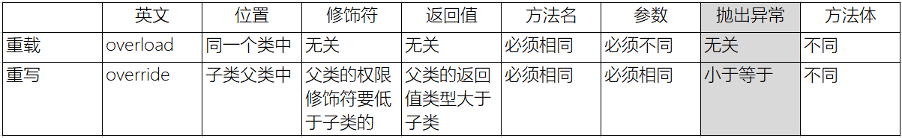

## 14. 深拷贝和浅拷贝区别了解吗？什么是引用拷贝？

（一）引用拷贝

当我们想复制一个对象时，最自然的操作就是：直接赋值给另一个变量。如下代码：

```java
public class Person {
    int age;
    public Person(int age) {
        this.age = age;
    }
}

class Test{
    public static void main(String[] args) {
        Person p1 = new Person(18);
        Person p2 = p1;
        p2.age = 20;

        System.out.println(p1 == p2);// true
        System.out.println(p1.age);// 20
        System.out.println(p2.age);// 20
    }
}
```

这种做法只复制了对象的地址，两个变量指向了同一个对象。任意一个变量操作了对象的属性，都会影响到另一个变量。这种对同一个对象的操作，算不上真正意义的复制，所以引用拷贝算不上对象拷贝。

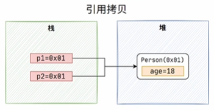

对象拷贝，一般说的就是浅拷贝和深拷贝。

（二）浅拷贝

浅拷贝的实现，类实现Cloneable接口：

```java
public class Person implements Cloneable{// 实现Cloneable接口，
    int age;
    public Person(int age) {
        this.age = age;
    }

    // 重写Object的clone方法，修改修饰符为public，返回值为Person，方法体：
    @Override
    public Person clone() throws CloneNotSupportedException {
        return (Person)super.clone();
    }
}

class Test{
    public static void main(String[] args) throws CloneNotSupportedException {
        Person p1 = new Person(18);
        Person p2 = p1.clone();
        p2.age = 20;

        System.out.println(p1 == p2);// false
        System.out.println(p1.age);// 18
        System.out.println(p2.age);// 20
    }
}
```

发现两个变量指向的是不同的对象：

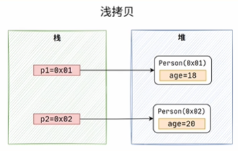

各自改变属性，也不会影响到另一个对象。但是还是存在问题的，如果拷贝的对象中有属性是引用数据类型，浅拷贝会直接复制内部对象的引用地址，也就是说拷贝对象和原对象的属性共用同一个对象。

如下代码：

```java
public class Person implements Cloneable{// 实现Cloneable接口，
    int age;
    int[] arr = new int[]{11,22,33};// 属性为引用数据类型
    public Person(int age) {
        this.age = age;
    }

    // 重写Object的clone方法，修改修饰符为public，返回值为Person，方法体：
    @Override
    public Person clone() throws CloneNotSupportedException {
        return (Person)super.clone();
    }
}
```

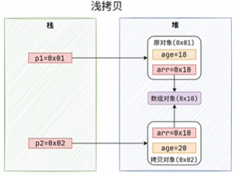

如果对其中一个引用类型的属性操作，那么会影响另一个对象的属性。

所以：浅拷贝会在堆上创建一个新的对象，不过，如果原对象内部的属性是引用类型的话，浅拷贝会直接复制内部对象的引用地址，也就是说拷贝对象和原对象的属性共用同一个对象。

（三）深拷贝

深拷贝会完全复制整个对象，包括这个对象所包含的内部对象。

实现，修改克隆方法：

```java
public class Person implements Cloneable{// 实现Cloneable接口，
    int age;
    int[] arr = new int[]{11,22,33};// 属性为引用数据类型
    public Person(int age) {
        this.age = age;
    }

    // 重写Object的clone方法，修改修饰符为public，返回值为Person，方法体：
    @Override
    public Person clone() throws CloneNotSupportedException {
        Person p = (Person)super.clone();
        p.arr.clone();
        return p;
    }
}
```

克隆对象以后，再对对象的属性也进行克隆，实现深拷贝。

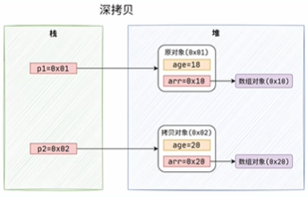

---

AI解析:
# 🔬 显微镜下的深拷贝源码解析

> **创建时间**：2026-03-10
> **标签**：#Java基础 #深拷贝 #this #super #clone机制

我们先来看一段标准的、能真正实现深拷贝的代码：

       ```java
       public class Person implements Cloneable {
         int age;
         int[] arr = new int[]{11, 22, 33}; // 引用类型属性
       
         @Override
         public Person clone() throws CloneNotSupportedException {
           // 第一步：调用父类的克隆方法，生成外壳
           Person p = (Person) super.clone();
       
           // 第二步：对内部的引用类型进行二次克隆
           p.arr = this.arr.clone();
       
           // 第三步：返回完全独立的全新对象
           return p;
         }
       }
- 下面我们逐行拆解，解答你的所有疑惑。
###  疑问一：为什么可以直接调用 clone() 方法？
1. clone() 是哪里来的？
- Java 中所有的类，只要你没写 extends，它们都有一个共同的老祖宗：Object 类。
- 而 clone() 方法，就是 Object 老祖宗自带的一个方法。所以你的 Person 类天生就继承了这个方法。
2. 为什么还要写 implements Cloneable？
- 虽然你有 clone() 方法，但 Java 规定了一个安全机制：你想克隆，必须先领“许可证”。
- Cloneable 就是这个许可证（它是一个空的接口，里面什么方法都没有，只起标记作用）。
- 如果不写 implements Cloneable，你一调用 clone() 方法，程序立马抛出 CloneNotSupportedException（不支持克隆异常）的报错。
### 疑问二：Person p = (Person) super.clone(); 里的 super 是什么？
1. super 的含义
- super 指的是当前类的父类。因为 Person 没有显式继承其他类，所以它的父类就是全局老祖宗 Object。
super.clone() 的意思就是：去调用老祖宗 Object 里面写好的那个 clone() 方法。
2. 老祖宗的 clone() 做了什么？
- 老祖宗的 clone() 方法非常强大（它是底层 C++ 实现的 native 方法）。它的作用是：
- 在堆内存里瞬间开辟一块和当前对象一样大的新空间。
- 把当前对象里所有的内容（包括数字、包括引用的内存地址），原封不动地“复印”到新空间里。
- 注意：老祖宗给你的这个复印件，就是我们之前讲的**“浅拷贝”**。
3. 为什么要强转 (Person)？
- 因为老祖宗 Object.clone() 返回的类型是通用的 Object 类型。你需要告诉编译器：“我知道它实际上是个 Person 对象，请把它强转回 Person 装进变量 p 里。”
- 此时的状态：
- 经过第一步，我们得到了新对象 p（新房子）。它的 age 是新的，但它的 arr 数组还和老对象的 arr 共用着同一个内存地址！
### 疑问三：p.arr = this.arr.clone(); 里的 this 是谁？
- 这是实现深拷贝最核心的“点睛之笔”。
1. 搞清角色：p 和 this 分别是谁？
- 假设我们在测试类里是这样调用的：Person p2 = p1.clone();
- 此时程序进入了 p1 的 clone 方法内部：
this：指代的是当前正在调用方法的原对象，也就是老房子 p1。
- p：指代的是刚才第一步用 super.clone() 刚刚建出来的新对象，也就是新房子 p2 的雏形。
2. 这行代码在干什么？
this.arr.clone()：老对象（p1）说：“把我自己肚子里的那个 arr 数组，也单独进行一次克隆！”（因为数组本身也是对象，也自带 clone() 方法）。这就生成了一个全新的数组。
- p.arr = ...：把刚刚生成出来的全新数组的地址，赋值给新对象（p）的 arr 属性。

## 15. 什么是singleton？如何实现？写出代码。

单例模式是一种创建型设计模式，它确保一个类只有一个实例，并提供一个全局访问点来获取这个实例。

经典实现方式：

（一）饿汉式

```java
public class Singleton {
    // 在类加载时就完成实例化
    private static Singleton INSTANCE = new Singleton();

    // 私有构造函数，防止外部实例化
    private Singleton() {}

    // 提供全局访问点
    public static Singleton getInstance() {
        return INSTANCE;
    }

    public static void main(String[] args) {
        Singleton s1 = getInstance();
        Singleton s2 = getInstance();
        System.out.println(s1 == s2);// true
    }
}
```

优点：

- 实现简单，代码简洁。
- 线程安全：由于实例在类加载时创建，JVM 保证了线程安全。

缺点：

- 可能造成资源浪费：如果这个实例从头到尾都没被使用过，或者实例的创建过程非常耗费资源，那么这种提前创建的方式就不太合适。

（二） 懒汉式

**a) 非线程安全版本：**

```java
public class Singleton {
    // 静态实例变量，初始为null
    private static Singleton instance;

    // 私有构造函数，防止外部实例化
    private Singleton() {}

    public static Singleton getInstance() {
        if (instance == null) {
            instance = new Singleton();
        }
        return instance;
    }
}
```

缺点：在多线程环境下，如果多个线程同时进入 `if (instance == null)` 判断，可能会创建多个实例，违反单例原则。

**b) 线程安全版本（使用 synchronized）：**

```java
public class Singleton {
    // 静态实例变量，初始为null
    private static Singleton instance;

    // 私有构造函数，防止外部实例化
    private Singleton() {}

    public static synchronized  Singleton getInstance() {
        if (instance == null) {
            instance = new Singleton();
        }
        return instance;
    }
}
```

  优点：线程安全。
	缺点：每次调用 `getInstance()` 都需要进行同步，性能有开销。实际上只有第一次创建实例时需要同步。

（三）双重检查锁（Double-Checked Locking，DCL）

```java
public class DCLSingleton {
    // 使用 volatile 关键字禁止指令重排序，确保可见性
    private static volatile DCLSingleton instance;

    private DCLSingleton() {}

    public static DCLSingleton getInstance() {
        // 第一次检查：如果实例已存在，直接返回，避免不必要的同步
        if (instance == null) {
            // 同步代码块
            synchronized (DCLSingleton.class) {
                // 第二次检查：进入同步块后再次检查，确保只有一个线程创建实例
                if (instance == null) {
                    instance = new DCLSingleton();
                }
            }
        }
        return instance;
    }
}
```

**关键点：**

- **第一次检查 (**`**if (instance == null)**`**)**: 避免绝大多数不必要的同步，提高性能。
- **同步块 (**`**synchronized**`**)**: 保证只有一个线程进入创建实例的代码。
- **第二次检查 (**`**if (instance == null)**`**)**: 防止在等待锁的线程进入同步块后重复创建实例。
- `**volatile**` **关键字**：至关重要。它防止了指令重排序，确保 `instance = new DCLSingleton();` 这行代码的执行顺序是：1. 分配内存空间，2. 初始化对象，3. 将引用指向内存地址。如果没有 `volatile`，可能发生重排序（1->3->2），导致另一个线程拿到一个未完全初始化的对象。

**优点**：线程安全，延迟加载，且相比同步方法性能更高。
**缺点**：代码稍复杂。

---

AI解析:
# 👑 设计模式：单例模式 (Singleton) 彻底搞懂

> **创建时间**：2026-03-10
> **标签**：#设计模式 #单例模式 #多线程 #面试高频

**什么是单例模式？**
顾名思义：保证一个类在整个程序运行期间，**只有一个**实例（对象），并且提供一个全局都能拿到这个实例的方法。

**生活比喻：**
你的项目就是一个国家，单例模式就是国家的“皇帝”。全国只能有一个皇帝，所有人不管在什么地方找皇帝，找到的必须是同一个人。

**实现单例模式的两大核心套路：**
1. 必须把**构造方法私有化** (`private`)，防止别人在外面随便 `new` 出新皇帝。
2. 必须提供一个 `public static` 的方法（通常叫 `getInstance()`），作为找皇帝的唯一通道。

---

## 路线一：饿汉式（着急吃饭的急性子）

**理念**：我不管你以后用不用得着，反正程序一启动（类加载时），我就立马把这个唯一实例造出来！

        ```java
        public class Singleton {
          // 1. 程序一启动，立马造出唯一实例！
          private static Singleton INSTANCE = new Singleton();
        
          // 2. 构造方法私有化，杜绝别人 new
          private Singleton() {}
        
          // 3. 对外提供唯一的获取通道
          public static Singleton getInstance() {
            return INSTANCE;
          }
        }
-👍 优点：极其简单，绝对线程安全（因为类加载机制保证了 INSTANCE 只会被创建一次）。
-👎 缺点：浪费内存。如果你造这个对象需要很多资源，但程序运行半天都没人调用 getInstance()，那这个对象就白白占着茅坑不拉屎。
## 路线二：懒汉式（不见兔子不撒鹰）
- 理念：只有当你第一次真正调用 getInstance() 需要用到的时候，我才去创建实例。
### 版本 2.1：基础懒汉式（❌ 极度危险：线程不安全）

      public class Singleton {
        private static Singleton instance; // 初始为空，先不着急造
        private Singleton() {}
      
        public static Singleton getInstance() {
          if (instance == null) { // 如果是空的，说明是第一次来找
            instance = new Singleton(); // 现造一个
          }
          return instance;
        }
      }
💣 致命缺点：单线程没问题。但在多线程下，如果线程 A 和线程 B 同时走到 if (instance == null)，两人一看都是空的，于是各自进去 new 了一个。生出了两个皇帝！单例被破坏！
### 版本 2.2：同步懒汉式（✅ 线程安全，但太卡了）
- 为了解决同时进入的问题，我们在方法上加一把锁（synchronized）：

       public static synchronized Singleton getInstance() { // 加上 synchronized 锁
         if (instance == null) {
           instance = new Singleton();
         }
         return instance;
       }
👎 缺点：性能极差。虽然解决了生多个皇帝的问题，但这就相当于每次找皇帝都要排队。其实只有第一次造皇帝的时候需要排队，以后皇帝都存在了，大家直接去拿就行了，为什么每次拿还要排队解锁？
## 路线三：DCL 双重检查锁（终极进化完全体）🏆
这是面试中最爱考、含金量最高的写法。它完美兼顾了“懒加载”、“线程安全”和“高性能”。

     public class DCLSingleton {
       // 🌟 关键 1：必须加上 volatile，防止指令重排序！
       private static volatile DCLSingleton instance;
     
       private DCLSingleton() {}
     
       public static DCLSingleton getInstance() {
         // 第一重检查：如果皇帝已经存在，直接拿走，不需要排队等锁！（提升了 99% 的性能）
         if (instance == null) {
     
           // 只有发现皇帝不在，才开始排队加锁准备造人
           synchronized (DCLSingleton.class) {
     
             // 第二重检查：抢到锁进来后，再看一眼！万一排在我前面的那个兄弟刚刚造完呢？
             if (instance == null) {
               instance = new DCLSingleton();
             }
           }
         }
         return instance;
       }
     }
🧠 面试官终极两连问：
- 提问 1：为什么要检查两次 (if 两次)？
- 第一层 if：为了性能。如果对象已经造好了，后来的线程就直接绕过 synchronized，直接 return 拿走，不用排队。
- 第二层 if：为了安全。假设线程A和B同时过了第一层 if。A抢到了锁进去把对象造了，释放锁。此时B抢到锁进去了，如果没有第二层 if，B会傻乎乎地又造一个对象。
- 提问 2：为什么要加 volatile 关键字？（不加会怎样？）
- 这行代码 instance = new DCLSingleton(); 在底层其实分为三步：
- 分配内存空间。
- 执行构造方法，初始化对象。
- 把 instance 变量指向那块内存地址。
- 如果不加 volatile：CPU 可能会“聪明”地打乱顺序（指令重排），变成 1 -> 3 -> 2。
- 假设线程 A 执行到了 3（此时 instance 已经有地址了，但对象还是空的半成品）。
- 此时线程 B 进来了，执行第一层 if (instance == null)。发现不为空！直接把这个半成品皇帝（未初始化的对象）拿出去用了，程序瞬间崩溃！
- 加了 volatile：严厉警告 CPU：不许乱排！必须老老实实按 1->2->3 的顺序执行！确保拿到的绝对是一个完整的对象。

## 16. Java中如何定义枚举？

Enum一般用来表示一组相同类型的常量，如性别、日期、月份、颜色等。对这些属性用常量的好处是不仅可以保证单例，且比较时候可以用”==”来替换equals，是一种好的习惯。JDK1.5之前没有Enum这个类型，那时候一般用接口常量来替代。

代码展示：自定义枚举类：

```java
public class Season {
    //属性：
    private final String seasonName ;//季节名字
    private final String seasonDesc ;//季节描述
    //利用构造器对属性进行赋值操作：
    //构造器私有化，外界不能调用这个构造器，只能Season内部自己调用
    private Season(String seasonName,String seasonDesc){
        this.seasonName = seasonName;
        this.seasonDesc = seasonDesc;
    }

    //提供枚举类的有限的  确定的对象：
    public static final Season SPRING = new Season("春天","春暖花开");
    public static final Season SUMMER = new Season("夏天","烈日炎炎");
    public static final Season AUTUMN = new Season("秋天","硕果累累");
    public static final Season WINTER = new Season("冬天","冰天雪地");


    @Override
    public String toString() {
        return "Season{" +
                "seasonName='" + seasonName + '\'' +
                ", seasonDesc='" + seasonDesc + '\'' +
                '}';
    }
}
public class Test {
    public static void main(String[] args) {
        // 创建季节对象：
        // Season s = new Season(); 错误

        // 只能使用内部定义的对象：
        Season autumn = Season.AUTUMN;
        System.out.println(autumn);
    }
}
```

​	JDK1.5以后使用enum关键字创建枚举类：

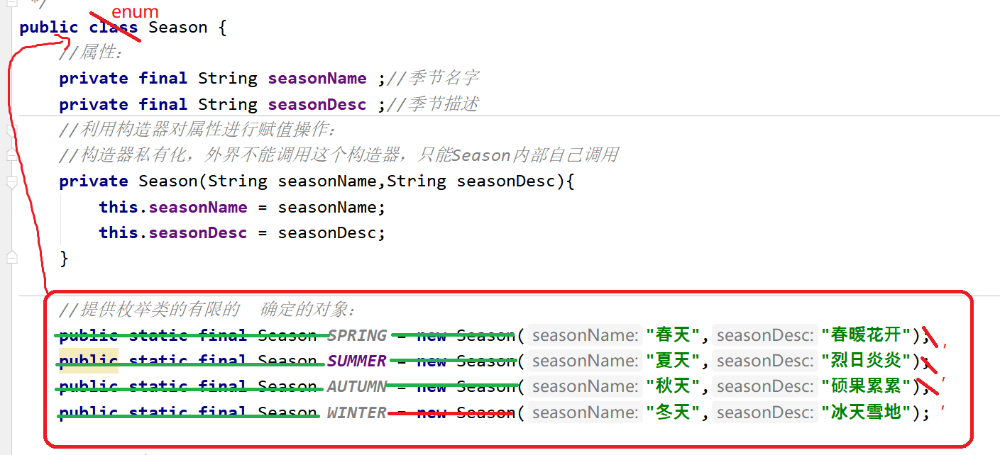

变为下面的枚举类：

```java
public enum Season {
    //提供枚举类的有限的  确定的对象：
    SPRING("春天","春暖花开"),
    SUMMER("夏天","烈日炎炎"),
    AUTUMN("秋天","硕果累累"),
    WINTER("冬天","冰天雪地");
    //属性：
    private final String seasonName ;//季节名字
    private final String seasonDesc ;//季节描述
    //利用构造器对属性进行赋值操作：
    //构造器私有化，外界不能调用这个构造器，只能Season内部自己调用
    private Season(String seasonName,String seasonDesc){
        this.seasonName = seasonName;
        this.seasonDesc = seasonDesc;
    }
    @Override
    public String toString() {
        return "Season{" +
                "seasonName='" + seasonName + '\'' +
                ", seasonDesc='" + seasonDesc + '\'' +
                '}';
    }
}
```

---

AI解析:
# 🥤 Java 枚举 (Enum)：被限定的“菜单”

> **创建时间**：2026-03-10
> **标签**：#Java基础 #Enum #单例模式 #规范设计

## ❓ 一、 为什么要发明枚举？

**生活比喻：**
你去一家高级奶茶店买奶茶。
*   **没有枚举的情况**：店员递给你一张白纸，让你自己写要什么甜度。你可能写“半糖”，也可能写“少糖”，甚至有人捣乱写“变态辣”。店员后台拿到纸条直接崩溃，还要写一堆 `if-else` 去判断。
*   **有枚举的情况**：店员直接给你递上一张**固定的菜单**：【全糖、七分糖、半糖、无糖】。**你只能在这 4 个选项里挑，绝对不可能选出第 5 种！**

这就是枚举的本质：**提供一组有限的、确定的常量选项。** 防止程序员瞎传参数。
比如：性别（男/女）、季节（春夏秋冬）、星期（周一到周日）。

---

## 🛠️ 二、 枚举的前世：手动打造“菜单” (JDK 1.5 之前)

在没有 `enum` 关键字的年代，前辈们为了实现这种“限定菜单”的效果，硬生生用普通类写出来了一套极其严谨的逻辑。（这其实就是刚才学的**单例模式**的变种——多例模式）。

        ```java
        public class Season {
          // 1. 属性定义
          private final String seasonName;
          private final String seasonDesc;
        
          // 2. 核心：构造器私有化！
          // 门从里面反锁了，外界绝对不可能 new Season() 造出新的季节！
          private Season(String seasonName, String seasonDesc){
            this.seasonName = seasonName;
            this.seasonDesc = seasonDesc;
          }
        
          // 3. 在类内部，提前把仅有的 4 个合法对象造出来，并设为公开、静态、不可变（常量）
          public static final Season SPRING = new Season("春天","春暖花开");
          public static final Season SUMMER = new Season("夏天","烈日炎炎");
          public static final Season AUTUMN = new Season("秋天","硕果累累");
          public static final Season WINTER = new Season("冬天","冰天雪地");
        
          // ... toString方法省略
        }
- 怎么用？
- 外面的人想用季节，由于不能 new，只能乖乖地调用你提前写好的那四个：
- Season s = Season.AUTUMN; (这就完全控制了输入范围！)
 ##       🚀 三、 枚举的今生：使用 enum 语法糖 (JDK 1.5 之后)
- 到了 JDK 1.5，Java 官方觉得上面那样写太麻烦了，每次都要写 public static final 和私有构造器，全是废话。
- 于是，官方推出了 enum 关键字，它就是前面那坨长代码的缩写版（语法糖）。
- 看下面这段代码，对比一下，你会发现它完全保留了原有的属性和构造方法，只是把顶部的那 4 个对象的创建过程极度简化了！

      // 把 class 换成 enum
      public enum Season {
      
        // 🌟 神奇的语法糖来了！
        // 下面这四行，就等价于上面的 public static final Season SPRING = new Season(...);
        // 必须写在枚举类的最前面第一行！
        SPRING("春天","春暖花开"),
        SUMMER("夏天","烈日炎炎"),
        AUTUMN("秋天","硕果累累"),
        WINTER("冬天","冰天雪地");
      
        // ================= 以下内容和普通类一模一样 =================
      
        private final String seasonName;
        private final String seasonDesc;
      
        // 构造器依然存在，且隐式强制为 private
        private Season(String seasonName, String seasonDesc){
          this.seasonName = seasonName;
          this.seasonDesc = seasonDesc;
        }
      }
## 💡 四、 为什么要用枚举？(核心优势)
- 极度安全，防呆设计：
- 在方法的参数上写死 public void setSeason(Season s)。那调用者只能传 Season.SPRING 等 4 个值。如果传别的字符串，代码直接编译报错，根本跑不起来。把错误扼杀在摇篮里。
- 天生的单例对象：
- Season.SPRING 这个对象，在 JVM 内存里永远只有一份。
- 可以直接用 == 比较：
- 因为内存里只有一份对象，所以比较时不需要用慢吞吞的 .equals()，直接用 if (s == Season.SPRING) 即可，代码不仅清爽，而且执行速度极快。

## 17. 什么是匿名内部类？如何实现？

在Java中，匿名内部类（Anonymous Inner Class）是一种没有名称的内部类。它允许你在声明和实例化一个类的时候，直接定义和创建它的实例。匿名内部类通常用于简化代码，特别是在需要创建一个类的实例并且该类只需要临时使用一次的时候。

```java
public interface MyInterface {
    void a();
}
public class TestOuter {
    //1. 如果类B在整个项目中只使用一次，那么就没有必要单独创建一个B类，使用内部类就可以了
    public MyInterface method1(){
        class B implements MyInterface{
            @Override
            public void a() {
                System.out.println("B类中重写a方法");
            }
        }
        return new B();
    }
    public MyInterface method2(){
        //2.匿名内部类（一种没有名称的内部类）
        return new MyInterface(){
            @Override
            public void a() {
                System.out.println("匿名内部类中重写a方法");
            }
        };
    }

    public MyInterface method2() {
        // 使用Lambda表达式替代匿名内部类
        return () -> System.out.println("Lambda表达式中重写a方法");
    }
    public void test(){
        MyInterface com = new MyInterface(){
            @Override
            public void a() {
                System.out.println("匿名内部类中重写a方法");
            }
        };
        com.a();
    }
}
```

## 18. Java的异常处理关键字：throws,throw,try,catch,finally分别代表什么意义？ 

Java的异常处理是通过5个关键词来实现的：try、catch、throw、throws和finally。一般情况下是用try来执行一段程序，如果出现异常，系统会抛出（throws）一个异常，这时候你可以通过它的类型来捕捉（catch）它，或最后（finally）由缺省处理器来处理。用try来指定一块预防所有"异常"的程序。紧跟在try程序后面，应包含一个catch子句来指定你想要捕捉的"异常"的类型。throw语句用来明确地抛出一个"异常"。throws用来标明一个成员函数可能抛出的各种"异常"。Finally为确保一段代码不管发生什么"异常"都被执行一段代码。

## 19. throw和throws的区别?

（1）位置不同：

throw：方法内部

throws: 方法的签名处，方法的声明处

（2）内容不同：

throw+异常对象（检查异常，运行时异常）

throws+异常的类型（可以多个类型，用，拼接）

（3）作用不同：

throw：异常出现的源头，制造异常。

throws:在方法的声明处，告诉方法的调用者，这个方法中可能会出现我声明的这些异常。然后调用者对这个异常进行处理：

要么自己处理要么再继续向外抛出异常

代码展示：

```java
public class Test7 {
    //这是一个main方法，是程序的入口：
    public static void main(String[] args) throws Exception {
        //实现一个功能：两个数相除，当除数为0的时候，程序出现异常。
        /*try {
            devide();
        } catch (Exception e) {
            e.printStackTrace();
        }*/
        devide();
    }
    public static void devide() throws Exception {
        Scanner sc = new Scanner(System.in);
        System.out.println("请录入第一个数：");
        int num1 = sc.nextInt();
        System.out.println("请录入第二个数：");
        int num2 = sc.nextInt();
        if(num2 == 0 ){//除数为0 ，制造异常。
            //制造运行时异常：
            /*throw new RuntimeException();*/
            //制造检查异常：
            /*try {
                throw new Exception();
            } catch (Exception e) {
                e.printStackTrace();
            }*/
            throw new Exception();
        }else{
            System.out.println("商："+num1/num2);
        }
    }
}
```

## 20. 如何使用try-with-resources代替try-catch-finally？

在Java中，`try-with-resources`语句是一种更简洁、更安全的方式来管理资源，它自动处理实现了`AutoCloseable`接口（或其子接口`Closeable`）的资源的关闭操作。这种方式可以替代传统的`try-catch-finally`结构，使得代码更加简洁且易于维护。

`try-with-resources`语句确保每个资源在语句结束时自动关闭，无论是正常结束还是异常结束。它通过在`try`关键字后面使用一对圆括号来声明一个或多个资源。

以下是一个使用`try-with-resources`的示例，以及一个等效的`try-catch-finally`结构作为对比：

- 使用`try-with-resources`

```java
import java.io.BufferedReader;
import java.io.FileReader;
import java.io.IOException;

public class TryWithResourcesExample {
    public static void main(String[] args) {
        String filePath = "example.txt";
        try (BufferedReader br = new BufferedReader(new FileReader(filePath))) {
            String line;
            while ((line = br.readLine()) != null) {
                System.out.println(line);
            }
        } catch (IOException e) {
            e.printStackTrace();
        }
        // 注意：这里不需要显式地关闭BufferedReader，因为try-with-resources会自动处理
    }
}
```

- 等效的`try-catch-finally`结构

```java
import java.io.BufferedReader;
import java.io.FileReader;
import java.io.IOException;

public class TryCatchFinallyExample {
    public static void main(String[] args) {
        String filePath = "example.txt";
        BufferedReader br = null;
        try {
            br = new BufferedReader(new FileReader(filePath));
            String line;
            while ((line = br.readLine()) != null) {
                System.out.println(line);
            }
        } catch (IOException e) {
            e.printStackTrace();
        } finally {
            if (br != null) {
                try {
                    br.close();
                } catch (IOException e) {
                    e.printStackTrace();
                }
            }
        }
    }
}
```

在`try-with-resources`示例中，`BufferedReader`在`try`语句的圆括号中声明，并且当`try`块结束时（无论是正常结束还是异常结束），它都会被自动关闭。这使得代码更加简洁，并且减少了忘记关闭资源的风险。

相比之下，`try-catch-finally`示例需要手动关闭资源，并且在`finally`块中处理关闭操作可能抛出的异常。这增加了代码的复杂性，并且如果忘记在`finally`块中关闭资源，可能会导致资源泄露。

因此，当使用实现了`AutoCloseable`接口的资源时，推荐使用`try-with-resources`语句来简化资源管理。_