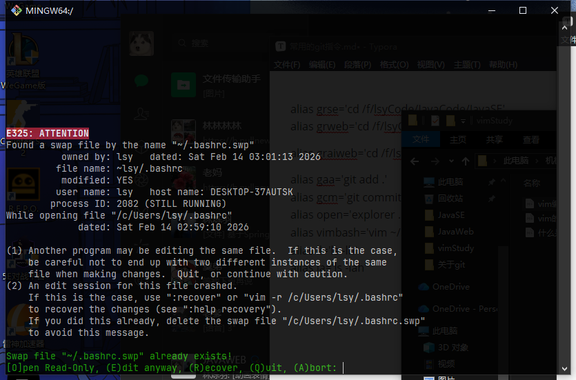

#  Vim编辑错误解决方法。


- 好的，这个问题是 Vim 用户经常遇到的经典问题，不用担心，它其实是 Vim 的一个安全保护机制。

  ### 问题原因（为什么会出现这个提示？）

  这个 E325: ATTENTION 提示的意思是：Vim 在尝试打开 .bashrc 文件时，发现了一个名为 ~/.bashrc.swp 的“交换文件”。

  这个 .swp 文件是 Vim 为了防止你意外丢失工作而创建的临时备份。它出现通常只有两种情况：

    1. **你已经在另一个终端窗口中打开了同一个文件**，并且正在编辑它。
    2. 上次编辑这个文件时，Vim 或你的终端**意外崩溃或被强制关闭了**，导致这个临时文件没有被正常删除。

  从你的截图中，Vim 给了我们一个**决定性的线索**：process ID: 2082 (STILL RUNNING)。
  这明确地告诉我们，**情况1是真实原因**：有一个进程ID为 2082 的 Vim 编辑器**当前正在运行**，并且它正在编辑 .bashrc 文件。

  ### 最安全、最推荐的解决方案

  既然我们知道是另一个 Vim 窗口打开了文件，那么最佳做法就是找到它并正常关闭。

  #### **第一步：退出当前的 Vim 会话**

  在当前这个出现错误的界面，直接按下键盘上的 **Q** 键，然后回车。（如果 Q 不行，就按 A）。
  这将安全地退出，不会对文件做任何修改。

  #### **第二步：找到并关闭另一个 Vim 窗口**

  你现在需要做的就是**找到那个已经打开 ~/.bashrc 的终端窗口**。

    - 它可能被最小化了。
    - 它可能是你之前打开的另一个 Git Bash 窗口。
    - 它可能在另一个虚拟桌面中。

  找到那个窗口后，正常地保存并退出 Vim：

    - 按下 Esc 键确保你处于普通模式。
    - 输入 :wq 然后回车（保存并退出）。
    - 或者输入 :q! 然后回车（不保存并强制退出）。

  只要你正常退出了那个正在运行的 Vim 会话，.swp 文件就会被**自动删除**。

  #### **第三步：重新打开文件**

  现在，回到你原来的终端窗口，再次输入 vim ~/.bashrc。
  这一次，因为 .swp 文件已经没了，Vim 就会正常打开文件，不会再有任何警告。

  ------


### 如果实在找不到那个正在运行的窗口怎么办？（备用方案）

如果你找遍了也找不到那个进程ID为 2082 的窗口，它可能是一个“僵尸进程”。你可以强制杀掉它。

1. **先按 Q 退出当前出错的 Vim 界面。**

2. **强制结束那个正在运行的进程。** 在你的 Git Bash 终端里，输入以下命令：

   codeBash


     ```
     kill 2082
     ```

     （2082 是你的截图里显示的进程ID）。

3. **手动删除交换文件。** 杀掉进程后，.swp 文件不会自动消失，你需要手动删除它：

   codeBash


     ```
     rm ~/.bashrc.swp
     ```

4. **现在可以正常打开了。** 再次输入 vim ~/.bashrc 即可。