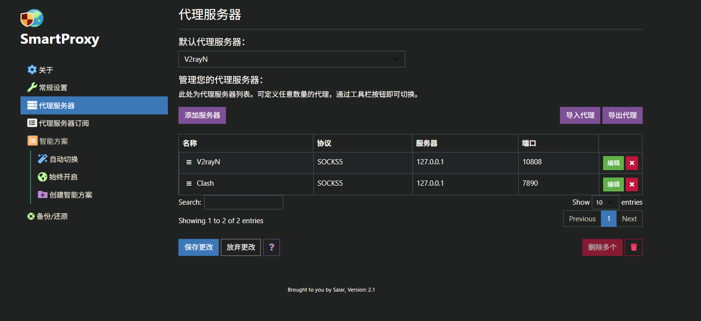
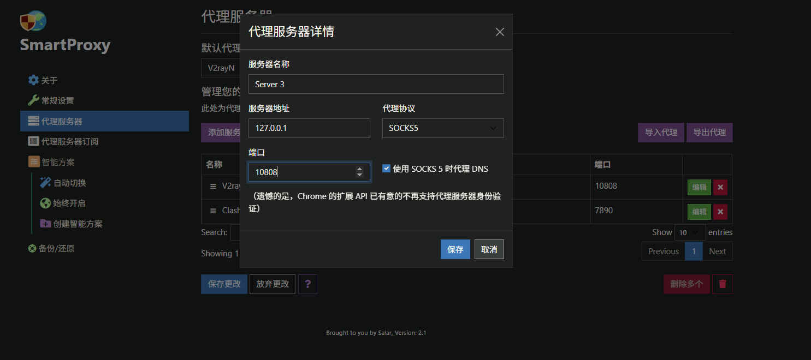
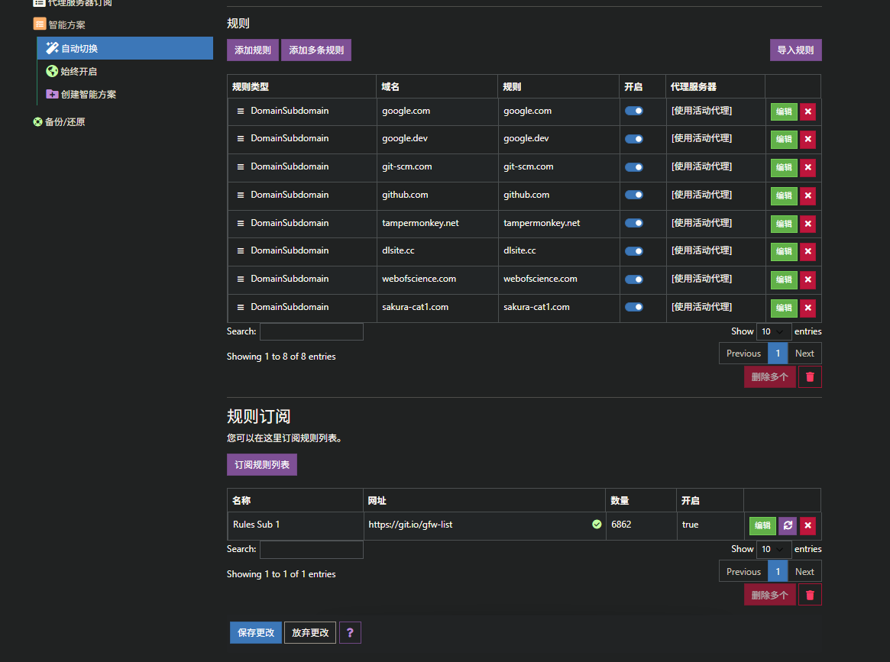
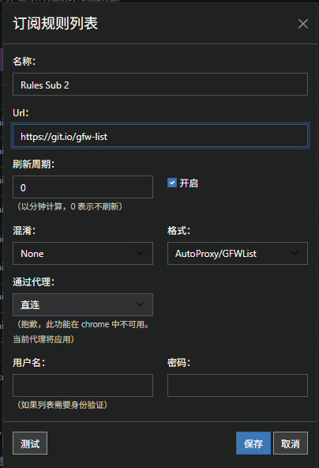

**一. 关于v2rayN基本的快捷键:**

在 v2rayN 中，选中所有节点（Ctrl + A）后，你要找的刷新（测试延迟）快捷键通常是以下两个中的一个：

1. **Ctrl + R**（推荐）：
    - 功能：**测试真连接延迟** (Test Real Delay)。
    - 说明：这是最准确的刷新方式。它会尝试通过节点实际访问目标网站（如 Google），能检测节点是否真的可用。
2. **Ctrl + T**：
    - 功能：**测试 TCP 延迟** (Test TCPing)。
    - 说明：这只是测试你的电脑连接到代理服务器的速度，**不能**代表节点是否能翻墙上网。

**总结：通常按 Ctrl + R 是你想要的效果。**

**二.如果梯子出现问题可以先按照上面的内容去确实是否是节点出现了问题;如果不是请按下列步骤依次操作:**

1. 在浏览器找到**SmartProxy**这个插件,并打开代理服务器查看:

点击添加服务器,找到对应梯子软件的端口,比如v2的端口是10808:

2. 点击智能方案,选择自动切换,找到规则订阅一栏:

点击订阅规则列表,

- Url:https://git.io/gfw-list  
(这是一个别人的在线支持的一个网址,可以筛选哪些网址是需要利用到梯子的)
- 混淆和格式选择第一项
- 通过代理:选择 **当前代理**  ,有些情况下没用当前代理的选项.默认为当前代理.
- 记得保存完毕还有一层需要保存

**三.这是对于一些梯子知识的补充**

1. **清除系统代理 (相当于“关”)**
    - **含义**：你的电脑（浏览器、软件）像往常一样直接连接互联网，**不经过** v2rayN。
    - **状态**：此时软件图标通常是**蓝色**的。
    - **场景**：当你不需要翻墙，或者你想用浏览器插件（如 SwitchyOmega）单独控制代理时使用。
2. **自动配置系统代理 (相当于“开”)**
    - **含义**：v2rayN 会告诉 Windows 系统：“所有的网页流量都交给我来处理！”
    - **状态**：此时软件图标通常是**红色**的。
    - **场景**：**这是最常用的模式**。当你想打开 Google 或 YouTube 时，必须选这个。

1. **V3 - 绕过大陆 (Whitelist) ——【推荐日常使用】**
    - **逻辑**：**智能分流**。
    - **工作方式**：v2rayN 会看你要访问的网站。
        - 如果是国内网站（淘宝、百度、B站） -> **直连**（速度快，不消耗代理流量）。
        - 如果是国外网站（Google、GitHub） -> **走代理**。
    - **优点**：访问国内网站不卡，访问国外网站能通，省流量且速度快。
2. **V3 - 黑名单 (Blacklist)**
    - **逻辑**：**只代理被墙的**。
    - **工作方式**：只有在“黑名单”（通常是 GFWList）里的网站才走代理，其他所有网站（包括国外没被墙的网站）都直连。
    - **缺点**：有些冷门的国外网站虽然没被墙，但直连很慢，在这个模式下体验不好。**一般不推荐选这个**。
3. **V3 - 全局 (Global)**
    - **逻辑**：**强制代理**。
    - **工作方式**：不管你访问百度还是 Google，**全部**都走代理服务器。
    - **场景**：
        - 当“绕过大陆”模式失效，某个网站打不开时，切到全局试试。
        - 当你需要把自己完全伪装成国外IP时。
    - **缺点**：访问国内网站会变慢（因为绕了一大圈），且非常消耗代理流量。

