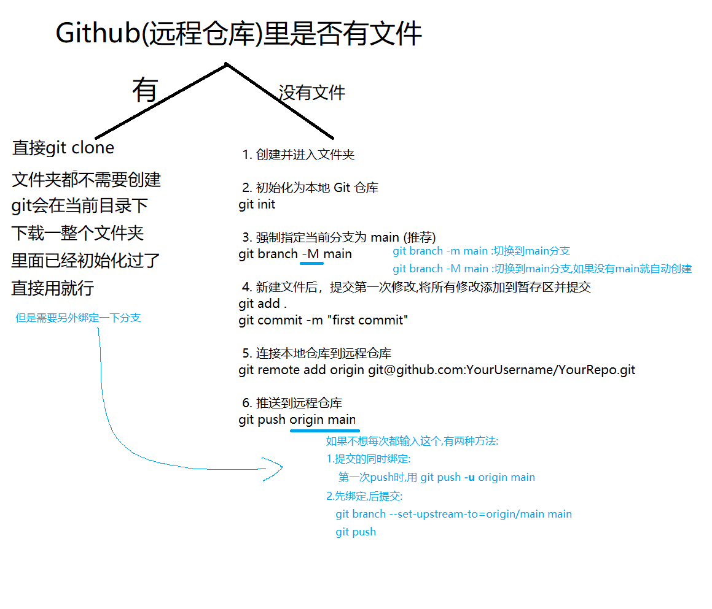

1. git init    #初始化仓库

2. 利用tree创建gitignore文件放在 本地文件同录内

   (gitignore文件会跟着代码文件一起上传,不需要单独上传gitignore文件)

3. git remote add origin git@github.com:(xxx).git         #这个是将本地仓库,连接到远程地址

   具体的SSM地址去github外部仓库找

4. git add .   #添加文件到暂存区

5. git commit -m "first commit"(备注)     #将暂存区提交至本地仓库

6. git push origin master  #将本地分支推送到远程origin的master分支

   同样的道理也可以推送到main分支

7. git branch --set-upstream-to=origin/master master

   或者(取决于你前面选择哪个)

   git branch --set-upstream-to=origin/main main

   #这两个是绑定本地的和远程的分支

   (不然每次都要git push origin master或git push origin main)

8. 注意事项!!!

下次看到这种一堆LF的,不管他就行了

(这个问题的原因是:这个是windows和linux的回车不一样的问题)

Windows的换行符是CRLF;liunx是LF, 但是git会自动转换,所以可以不用管这个问题的出现